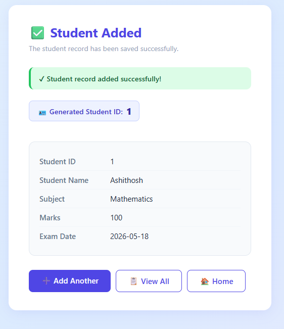
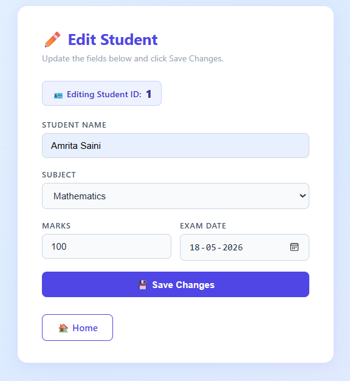
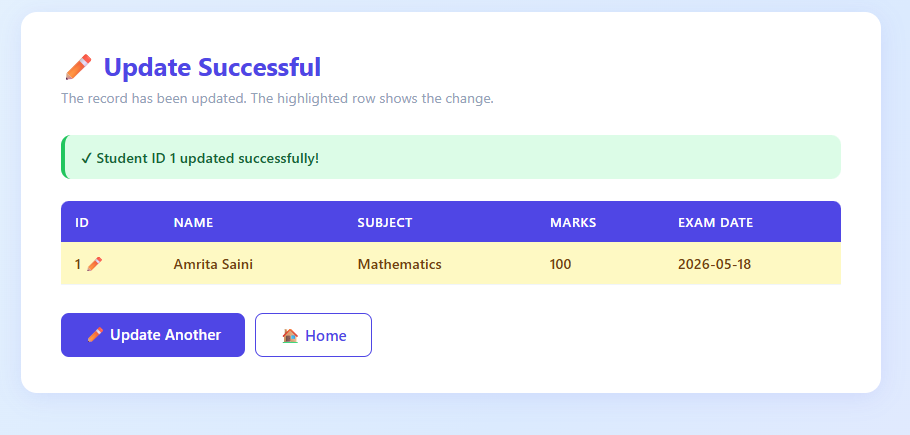
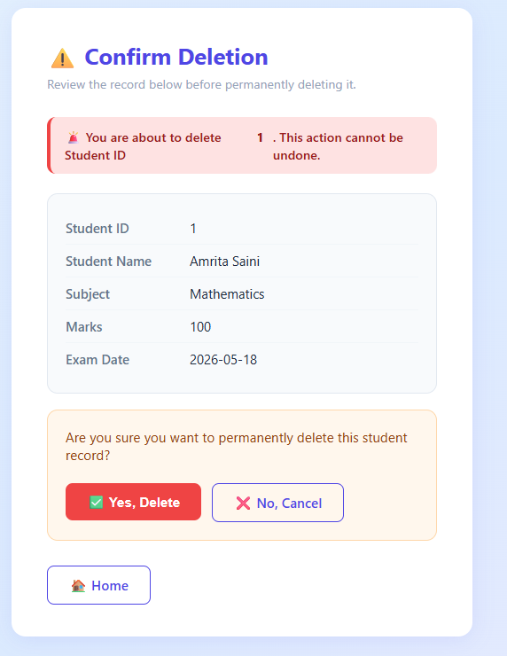
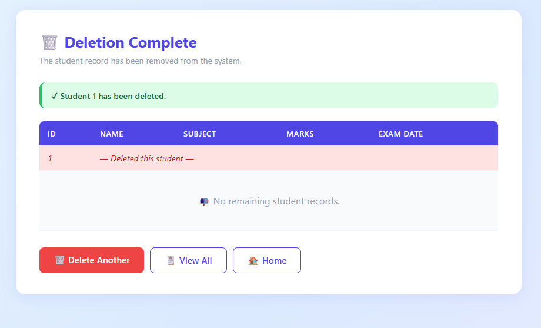

# 📘 Student Marks Management System (Mini Project)

## 👨‍🎓 Student Details

| Field       | Details                   |
|-------------|---------------------------|
| **Name**    | Amrita Rajput             |
| **USN**     | 4AL24CS038                |
| **Subject** | Advanced Java with J2EE   |

---

## 📌 Project Description

This is a **Dynamic Web Application** developed using **Java, JSP, Servlets, JDBC, and MySQL** to manage student mark records.

The system supports:

* Auto-generated Student IDs (AUTO\_INCREMENT)
* Add, Update, Delete, Display operations
* Pre-filled update form with live DB fetch
* Delete confirmation flow before permanent removal
* Report generation with Marks range, Subject, and Top N filters
* Clean, modern card-based UI with CSS styling
* Full MVC architecture with DAO pattern

---

## 🛠️ Technologies Used

| Layer        | Technology                     |
|--------------|--------------------------------|
| Frontend     | HTML, JSP, CSS (Card-based UI) |
| Backend      | Java Servlets                  |
| Database     | MySQL                          |
| Connectivity | JDBC (PreparedStatement only)  |
| Server       | Apache Tomcat                  |
| IDE          | Eclipse                        |

---

## 🗄️ Database Structure

```sql
CREATE DATABASE student_db;
USE student_db;

CREATE TABLE StudentMarks (
    StudentID   INT PRIMARY KEY AUTO_INCREMENT,
    StudentName VARCHAR(100)  NOT NULL,
    Subject     VARCHAR(50)   NOT NULL,
    Marks       INT           NOT NULL,
    ExamDate    DATE          NOT NULL
);
```

> **Key design decisions:**
> * `StudentID` is `AUTO_INCREMENT` — never entered manually by the user
> * `Subject` is not free text — selected from a fixed dropdown of 6 predefined subjects
> * Next ID is previewed before form submission using `information_schema` metadata

---

## 📁 Project Structure

```
MarkWebApp/
├── src/main/java/com/mark/
│   ├── model/
│   │   └── StudentMark.java
│   ├── dao/
│   │   └── MarkDAO.java
│   └── servlet/
│       ├── GetNextIdServlet.java        ← NEW
│       ├── AddMarkServlet.java
│       ├── UpdateMarkServlet.java
│       ├── DeleteMarkServlet.java
│       ├── DisplayMarkServlet.java
│       └── ReportServlet.java
│
└── src/main/webapp/
    ├── index.jsp
    ├── markadd.jsp                      ← Updated
    ├── add_result.jsp                   ← NEW
    ├── empupdate.jsp                    ← Updated
    ├── update_form.jsp                  ← NEW
    ├── update_result.jsp                ← NEW
    ├── empdelete.jsp                    ← Updated
    ├── delete_confirm.jsp               ← NEW
    ├── delete_result.jsp                ← NEW
    ├── empdisplay.jsp                   ← Updated
    ├── report_form.jsp                  ← Updated
    ├── report_result.jsp                ← NEW
    ├── error.jsp
    └── css/
        └── style.css                   ← Updated
```

---

# ⚙️ Modules with Code & Screenshots

---

## 🏠 Home Page

* 🔗 [`index.jsp`](src/main/webapp/index.jsp)

**Features:**
* Card-based navigation menu
* Links to all 5 modules
* Add Student card routes through `GetNextIdServlet` to pre-load the next ID

📸 Screenshot


---

## ➕ Add Student

* 🔗 JSP: [`markadd.jsp`](src/main/webapp/markadd.jsp)
* 🔗 Result JSP: [`add_result.jsp`](src/main/webapp/add_result.jsp)
* 🔗 Servlet: [`AddMarkServlet.java`](src/main/java/com/mark/servlet/AddMarkServlet.java)
* 🔗 ID Fetch Servlet: [`GetNextIdServlet.java`](src/main/java/com/mark/servlet/GetNextIdServlet.java)
* 🔗 DAO: [`MarkDAO.java`](src/main/java/com/mark/dao/MarkDAO.java)

**Features:**
* Next Student ID fetched from DB using `AUTO_INCREMENT` metadata and displayed as a **read-only preview** field before the form is submitted
* Subject is a **fixed dropdown** — no free text (6 predefined subjects)
* Labels above every input field
* Client-side + server-side validation:
  * Name — alphabets only, not empty
  * Marks — must be > 0
* After insert: shows generated ID and full student detail card

📸 Add Form


📸 Add Result


---

## ✏️ Update Student

* 🔗 Lookup JSP: [`empupdate.jsp`](src/main/webapp/empupdate.jsp)
* 🔗 Edit Form JSP: [`update_form.jsp`](src/main/webapp/update_form.jsp)
* 🔗 Result JSP: [`update_result.jsp`](src/main/webapp/update_result.jsp)
* 🔗 Servlet: [`UpdateMarkServlet.java`](src/main/java/com/mark/servlet/UpdateMarkServlet.java)

**Features:**
* Two-step flow:
  1. Enter Student ID → system fetches record from DB
  2. If found: pre-filled edit form shown; if not found: styled error message
* After update: displays **all students** in a table with the updated row **highlighted in yellow**
* Validation same as Add module

📸 Lookup Step


📸 Pre-filled Edit Form


📸 Update Result (highlighted row)


---

## 🗑 Delete Student

* 🔗 Lookup JSP: [`empdelete.jsp`](src/main/webapp/empdelete.jsp)
* 🔗 Confirmation JSP: [`delete_confirm.jsp`](src/main/webapp/delete_confirm.jsp)
* 🔗 Result JSP: [`delete_result.jsp`](src/main/webapp/delete_result.jsp)
* 🔗 Servlet: [`DeleteMarkServlet.java`](src/main/java/com/mark/servlet/DeleteMarkServlet.java)

**Features:**
* Three-step flow:
  1. Enter Student ID
  2. System fetches and displays the student's full details
  3. User confirms with **Yes / No** buttons before deletion occurs
* After deletion: shows message — *"Student [ID] has been deleted successfully"*
* No accidental deletes — confirmation is mandatory

📸 Lookup Step


📸 Confirmation Screen


📸 Deletion Result


---

## 🔍 Display All Students

* 🔗 JSP: [`empdisplay.jsp`](src/main/webapp/empdisplay.jsp)
* 🔗 Servlet: [`DisplayMarkServlet.java`](src/main/java/com/mark/servlet/DisplayMarkServlet.java)

**Features:**
* Displays all student records in a styled table
* Columns: ID, Name, Subject, Marks, Exam Date
* Alternating row colors for readability
* Left-aligned text throughout
* Empty-state message when no records exist

📸 Screenshot


---

## 📊 Reports Module

### 🔹 Report Form

* 🔗 JSP: [`report_form.jsp`](src/main/webapp/report_form.jsp)

**Three tabbed filter sections:**

| Tab       | Filter                                 | Inputs                  |
|-----------|----------------------------------------|-------------------------|
| By Marks  | `Marks BETWEEN ? AND ?` / `>=` / `<=` | Min Marks, Max Marks    |
| By Subject| `Subject = ?`                          | Subject dropdown        |
| Top N     | `ORDER BY Marks DESC LIMIT ?`          | N (number of students)  |

📸 Report Form


---

### 🔹 Report Results

* 🔗 Result JSP: [`report_result.jsp`](src/main/webapp/report_result.jsp)
* 🔗 Servlet: [`ReportServlet.java`](src/main/java/com/mark/servlet/ReportServlet.java)

**Marks filter smart logic:**

```java
if (min present && max present)  → WHERE Marks BETWEEN min AND max
if (only min present)            → WHERE Marks >= min
if (only max present)            → WHERE Marks <= max
```

📸 Report Result


---

# 🧱 Core Components

---

## 🧠 Model — `StudentMark.java`

* 🔗 [`StudentMark.java`](src/main/java/com/mark/model/StudentMark.java)

| Field         | Type     | Notes                        |
|---------------|----------|------------------------------|
| `studentID`   | `int`    | Auto-generated by DB         |
| `studentName` | `String` | Alphabets only               |
| `subject`     | `String` | One of 6 predefined subjects |
| `marks`       | `int`    | Must be > 0                  |
| `examDate`    | `Date`   | Date of examination          |

---

## 🔌 DAO — `MarkDAO.java`

* 🔗 [`MarkDAO.java`](src/main/java/com/mark/dao/MarkDAO.java)

| Method | Description |
|--------|-------------|
| `getNextStudentId()` | Fetches `AUTO_INCREMENT` value from `information_schema` — no insert performed |
| `addMark(StudentMark s)` | Inserts and returns actual generated ID via `RETURN_GENERATED_KEYS` |
| `getMark(int id)` | Fetches single student by ID |
| `getAllMarks()` | Returns all students ordered by ID |
| `updateMark(StudentMark s)` | Updates all fields by StudentID |
| `deleteMark(int id)` | Deletes by StudentID |
| `getReportByMarks(Integer min, Integer max)` | Smart min/max marks range filter |
| `getReportBySubject(String subject)` | Exact subject match filter |
| `getTopNStudents(int n)` | Top N students by marks DESC |

> All methods use `PreparedStatement` exclusively — no raw `Statement` used anywhere.

---

## 🎨 CSS — `style.css`

* 🔗 [`style.css`](src/main/webapp/css/style.css)

| Feature         | Detail                                               |
|-----------------|------------------------------------------------------|
| Layout          | Card-based, centered, max-width containers           |
| Theme           | Light, clean, white cards on `#f0f4f8` background   |
| Forms           | Labels above inputs, consistent spacing              |
| Buttons         | Color-coded: primary (blue), danger (red), secondary (grey) |
| Tables          | Left-aligned, alternating row colors, indigo header  |
| Alerts          | Styled success (green), error (red), info (blue) boxes |
| Highlight       | Yellow row highlight for updated student             |
| Read-only field | Dashed indigo border with light blue background      |

---

# 📊 SQL Queries Used

### Marks Range Filter
```sql
-- Both bounds
SELECT * FROM StudentMarks WHERE Marks BETWEEN ? AND ? ORDER BY Marks DESC;

-- Only min
SELECT * FROM StudentMarks WHERE Marks >= ? ORDER BY Marks DESC;

-- Only max
SELECT * FROM StudentMarks WHERE Marks <= ? ORDER BY Marks DESC;
```

### Subject Filter
```sql
SELECT * FROM StudentMarks WHERE Subject = ? ORDER BY Marks DESC;
```

### Top N Students
```sql
SELECT * FROM StudentMarks ORDER BY Marks DESC LIMIT ?;
```

### Next Auto-Increment ID (no insert)
```sql
SELECT AUTO_INCREMENT
FROM information_schema.TABLES
WHERE TABLE_SCHEMA = 'student_db'
AND TABLE_NAME = 'StudentMarks';
```

---

# 🔄 Request Flow Diagrams

### Add Student Flow
```
Home → /getNextId (GetNextIdServlet)
     → markadd.jsp  [shows next ID preview, form]
     → POST /addMark (AddMarkServlet)
     → add_result.jsp [confirms with real ID + detail card]
```

### Update Student Flow
```
Home → empupdate.jsp [enter ID]
     → GET /updateMark (UpdateMarkServlet)
     → ID found?  YES → update_form.jsp [pre-filled]
                  NO  → error on empupdate.jsp
     → POST /updateMark
     → update_result.jsp [all students, updated row highlighted]
```

### Delete Student Flow
```
Home → empdelete.jsp [enter ID]
     → GET /deleteMark (DeleteMarkServlet)
     → ID found?  YES → delete_confirm.jsp [show data + Yes/No]
                  NO  → error on empdelete.jsp
     → POST /deleteMark (confirmed)
     → delete_result.jsp ["Student X has been deleted successfully"]
```

---

# ▶️ How to Run

1. Clone or import the project into **Eclipse**
2. Configure **Apache Tomcat** (v9 or above)
3. Add **MySQL Connector/J** JAR to:
   * Build Path (`Project → Properties → Java Build Path → Libraries`)
   * `src/main/webapp/WEB-INF/lib/`
4. Run the SQL script to create the database:
   ```sql
   CREATE DATABASE student_db;
   USE student_db;

   CREATE TABLE StudentMarks (
       StudentID   INT PRIMARY KEY AUTO_INCREMENT,
       StudentName VARCHAR(100)  NOT NULL,
       Subject     VARCHAR(50)   NOT NULL,
       Marks       INT           NOT NULL,
       ExamDate    DATE          NOT NULL
   );
   ```
5. Update DB credentials in `MarkDAO.java`:
   ```java
   private String url  = "jdbc:mysql://localhost:3306/student_db";
   private String user = "root";
   private String pass = "your_password";
   ```
6. **Run on Server** → Open browser at `http://localhost:8080/MarkWebApp/`

---

# 🧠 Conclusion

This project demonstrates a complete **Student Marks Management System** built with core Java EE technologies. It provides hands-on experience with:

* **MVC architecture** — clean separation of Model, View (JSP), and Controller (Servlet)
* **JDBC with PreparedStatement** — safe, injection-proof database operations
* **Auto-increment ID handling** — fetching MySQL metadata without dummy inserts
* **Multi-step user flows** — confirm-before-delete, pre-filled update forms
* **Dynamic report generation** — flexible marks range, subject, and Top N filters
* **Modern JSP-based UI** — card layout, styled alerts, highlighted table rows

---

*Developed as a Mini Project for Advanced Java with J2EE — Amrita Rajput*
