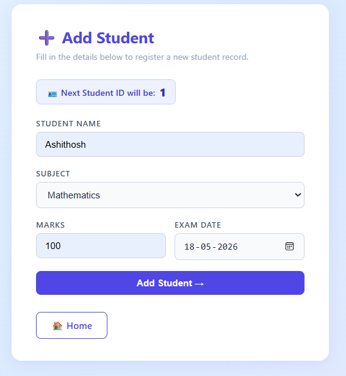
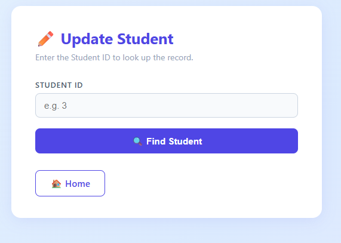
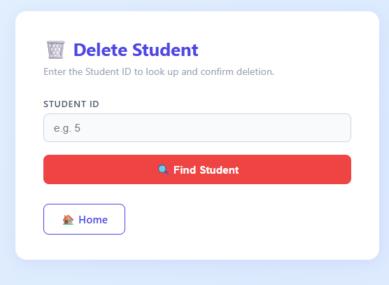
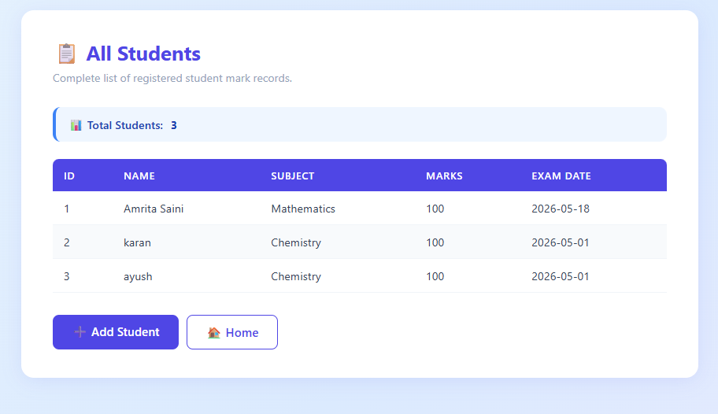
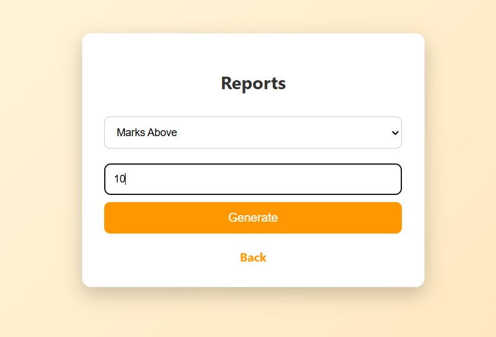
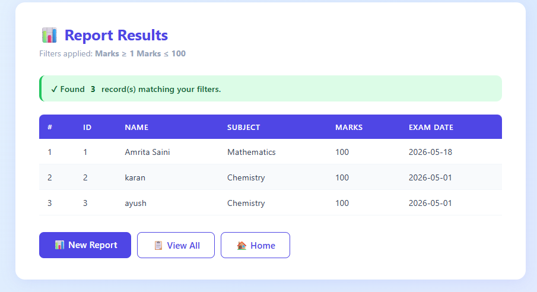

# 📘 Student Marks Management System (Mini Project)

## 👨‍🎓 Student Details

* **Name:** Amrita Saini
* **USN:** 4al24cs038
* **Subject:** Advanced Java with J2EE

---

## 📌 Project Description

This is a **Dynamic Web Application** built using **Java, JSP, Servlets, JDBC, and MySQL** to manage student examination marks.

The system supports:

* Add, Update, Delete, Display operations
* Report generation based on filters
* Clean UI with CSS styling

---

## 🛠️ Technologies Used

* Frontend: HTML, JSP, CSS
* Backend: Java Servlets
* Database: MySQL
* Connectivity: JDBC
* Server: Apache Tomcat
* IDE: Eclipse

---

## 🗄️ Database Structure

```sql id="m1"
CREATE TABLE StudentMarks (
    StudentID INT PRIMARY KEY,
    StudentName VARCHAR(100),
    Subject VARCHAR(50),
    Marks INT,
    ExamDate DATE
);
```

---

## 📁 Project Structure

```id="m2"
MarkWebApp/
├── WebContent/
│   ├── index.jsp
│   ├── markadd.jsp
│   ├── markupdate.jsp
│   ├── markdelete.jsp
│   ├── markdisplay.jsp
│   ├── report_form.jsp
│   └── css/style.css
│
├── src/com/mark/
│   ├── model/StudentMark.java
│   ├── dao/MarkDAO.java
│   └── servlet/
│       ├── AddMarkServlet.java
│       ├── UpdateMarkServlet.java
│       ├── DeleteMarkServlet.java
│       ├── DisplayMarkServlet.java
│       └── ReportServlet.java
```

---

# ⚙️ Modules with Code & Screenshots

---

## 🏠 Home Page

* 🔗 [index.jsp](src/main/webapp/index.jsp)

📸 Screenshot


---

## ➕ Add Mark

* 🔗 JSP: [markadd.jsp](src/main/webapp/markadd.jsp)
* 🔗 Servlet: [AddMarkServlet.java](src/main/java/com/mark/servlet/AddMarkServlet.java)
* 🔗 DAO: [MarkDAO.java](src/main/java/com/mark/dao/MarkDAO.java)

📸 Screenshot


---

## ✏️ Update Mark

* 🔗 JSP: [markupdate.jsp](src/main/webapp/markupdate.jsp)
* 🔗 Servlet: [UpdateMarkServlet.java](src/main/java/com/mark/servlet/UpdateMarkServlet.java)

📸 Screenshot


---

## 🗑 Delete Mark

* 🔗 JSP: [markdelete.jsp](src/main/webapp/markdelete.jsp)
* 🔗 Servlet: [DeleteMarkServlet.java](src/main/java/com/mark/servlet/DeleteMarkServlet.java)

📸 Screenshot


---

## 🔍 Display Mark

* 🔗 JSP: [markdisplay.jsp](src/main/webapp/markdisplay.jsp)
* 🔗 Servlet: [DisplayMarkServlet.java](src/main/java/com/mark/servlet/DisplayMarkServlet.java)

📸 Screenshot


---

## 📊 Reports Module

### 🔹 Report Form

* 🔗 JSP: [report_form.jsp](src/main/webapp/report_form.jsp)

📸 Screenshot


---

### 🔹 Report Results

* 🔗 Servlet: [ReportServlet.java](src/main/java/com/mark/servlet/ReportServlet.java)

📸 Screenshot


---

# 🧱 Core Components

---

## 🧠 Model

* 🔗 [StudentMark.java](src/main/java/com/mark/model/StudentMark.java)

---

## 🔌 DAO

* 🔗 [MarkDAO.java](src/main/java/com/mark/dao/MarkDAO.java)

---

## 🎨 CSS

* 🔗 [style.css](src/main/webapp/css/style.css)

---

# 📊 Reports Implemented

### Marks Above Value

```sql id="m3"
SELECT * FROM StudentMarks WHERE Marks > X;
```

### Subject Filter

```sql id="m4"
SELECT * FROM StudentMarks WHERE Subject = 'Math';
```

### Top N Students

```sql id="m5"
SELECT * FROM StudentMarks ORDER BY Marks DESC LIMIT N;
```

---

# ▶️ How to Run

1. Import project into Eclipse
2. Configure Apache Tomcat
3. Add MySQL Connector (Build Path + WEB-INF/lib)
4. Create database
5. Run project


---

# 🧠 Conclusion

This project demonstrates a complete **Student Marks Management System** using Java technologies. It showcases practical implementation of **JSP, Servlets, JDBC, and MySQL integration**, along with a clean modular architecture.

---
